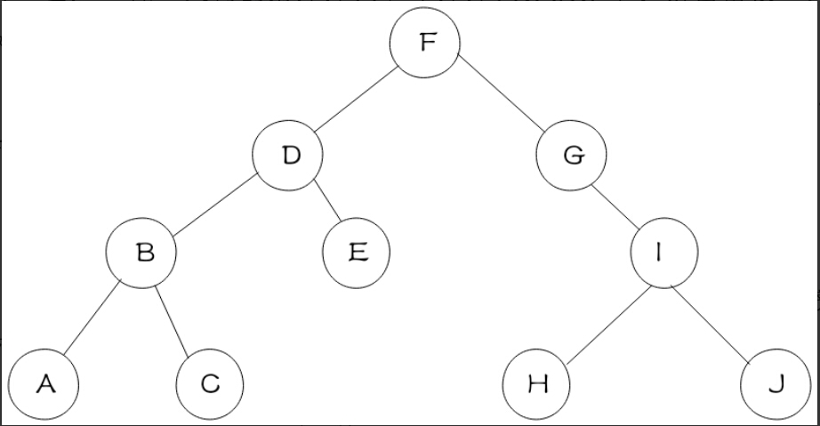

# 二叉树的前序、中序和后序
二叉树的遍历主要有3中，前序、中序和后序。
很多人经常只记住了名字，但是记不住前序、中序和后序到底是如何遍历的。
这里我们只要记住，前序，中序和后序指的是根节点的位置即可，即(根)前序，(根)中序，(根)后序，意思就是根节点，左节点，右节点的顺序。
* (根前序)根左右
* (根中序)做根右
* (根后序)左右根
这样子就非常形象了。

下面，根据实际的一个二叉树举例说明

前序遍历结果为：FDBACEGIHJ
中序遍历结果为：ABCDEFGIHJ
后序遍历结果为：ACBEDHJIGF