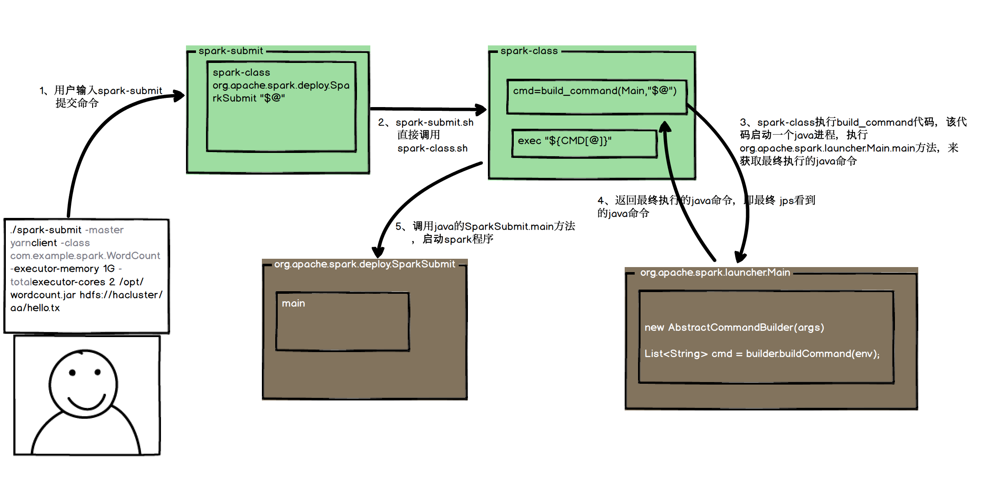

# spark 的启动流程?

## shell端的启动流程
以一个常规的wordcount 程序spark启动命令为例，spark在shell端的启动流程如下



1.  首先，用户在shell端提交spark提交命令，一个常见的workcount提交命令如下

```shell
./spark-submit --master yarn-client --class com.example.spark.WordCount --executor-memory 1G --total-executor-cores 2 /opt/wordcount.jar hdfs://hacluster/aa/hello.tx
```

该命令表示像yarn提交一个spark程序进行运行，在shell端的执行流程如下。

2. spark-submit 比较简单，直接将shell后面的参数转交给spark-class，并告诉spark-class以后运行的java类为 org.apache.spark.deploy.SparkSubmit。

```shell
exec "${SPARK_HOME}"/bin/spark-class org.apache.spark.deploy.SparkSubmit "$@"
```

3. 此时程序在spark-class执行
* spark-class会对环境变量做一些简单的查找和配置，如设置SPARK_HOME,SPARK_JARS_DIR,JAVA_HOME等
* 调用build_command方法获取最终要执行的java命令，该命令会调用org.apache.spark.launcher.Main

build_command的代码如下
```shell
    build_command() {
    "$RUNNER" -Xmx128m -cp "$LAUNCH_CLASSPATH" org.apache.spark.launcher.Main "$@"
    printf "%d\0" $?
    }
``` 
该代码将shell后面的参数传入org.apache.spark.launcher.Main，获取执行结果


4. org.apache.spark.launcher.Main，该类根据传入的参数,拼装classpath，jar等参数，返回最终要执行的java命令给spark-class

* 输入：shell后面自带的参数，如 
  --class com.example.spark.WordCount 
  --executor-memory 1G
* 输出我们看到的最终执行的java命令,如
    ```java
    /opt/java/bin/java -cp /opt/spark/conf/:/opt/spark/jars/*  -Xmx1g org.apache.spark.deploy.SparkSubmit --master yarn --class com.example.spark.WordCount --executor-memory 1G --total-executor-cores 2 /opt/wordcount.jar hdfs://hacluster/aa/hello.tx
    ```
* 执行过程
  Main类通过一个标准的建造者模式，传入参数，构建AbstractCommandBuilder
  ```java
   AbstractCommandBuilder builder;
        if (className.equals("org.apache.spark.deploy.SparkSubmit")) {
          try {
            builder = new SparkSubmitCommandBuilder(args);
  ```

  最后传入env返回cmdList,通过对应系统的prepareCommand输出，由spark-class shell接收回参数
  ```java
  List<String> cmd = builder.buildCommand(env);
    if (printLaunchCommand) {
      System.err.println("Spark Command: " + join(" ", cmd));
      System.err.println("========================================");
    }

    if (isWindows()) {
      System.out.println(prepareWindowsCommand(cmd, env));
    } else {
      // In bash, use NULL as the arg separator since it cannot be used in an argument.
      List<String> bashCmd = prepareBashCommand(cmd, env);
      for (String c : bashCmd) {
        System.out.print(c);
        System.out.print('\0');
      }
    }
  ```

1. spark-class 执行最终的启动命令
```shell
CMD=("${CMD[@]:0:$LAST}")
exec "${CMD[@]}"
```


至此，在shell端的代码执行完毕，spark程序进入真正运行的java端代码

