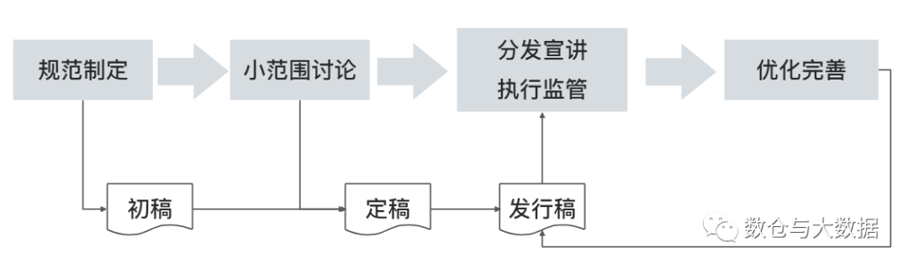
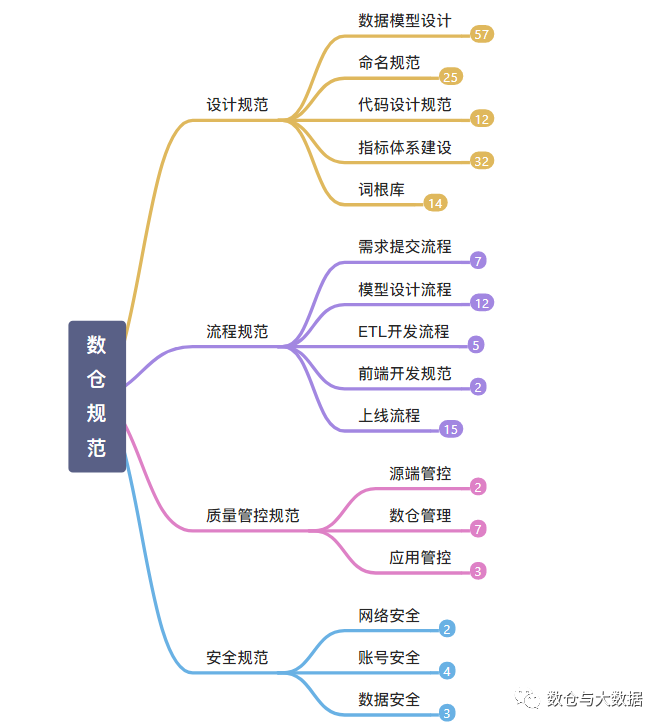
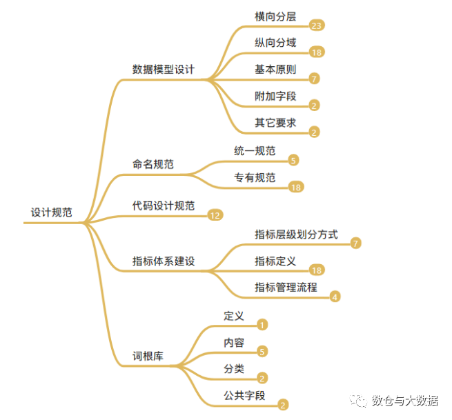

# 文章来源
本文转自 [全网最全数仓规范](https://mp.weixin.qq.com/s/Hqui7kwG-QISfnFSqedRkQ)

# 规范该怎么落地？

1、 规范制定

从 0 到 1，从无到有，这个环节应该有 Leader 或架构师，充分考虑公司实际情况，参考行业标准或约定俗成的规范，综合统一制定。

也可以将规范拆分后交由各个部分核心开发人员编写， Leader 或架构师统一整合。比如我们之前的团队就是，模型设计师负责模型设计规范，ETL 工程师负责 ETL 开发规范，BI 开发人员制定前端开发规范，部署上线规范直接采用项目上已有的即可。

总体上，初稿应该尽量保证规范的完整性和各个部分间的兼容性。

2、规范讨论

初稿完成后，难免有考虑不周的情况，这时候最好有 Leader  牵头，组织部分核心成员（人数不易太多，三五个即可。人多容易造成混乱、决策困难、没有人提意见造成 Leader 一言堂等等问题。）进一步完善各个细节，纠正初稿的不足。

多人共同完善的规范，理论上来讲不会有什么大问题了。

3、规范推行

定稿后，规范已经具备了全面推广的条件，可以下发所有团队成员。
    
可以通过群聊天，也可以通过正式回邮件的方式，当然为了引起大家的重视，可以专门组会宣讲。

分发宣讲后进入执行阶段，所有人必须严格遵守，如有违犯给予警告，严重的给予惩罚，屡劝不改的取消年终调级调薪等。

为了确保规范的贯彻落实，除了通过以上两点引起全员重视外，还需要组织、制度、流程上的多方面保障。

数据模型应该有统一归口，比如数据架构师，架构师定期检查模型是否合理合规。

组织数据开发人员，定期 Review 每个人的代码，但不必针对个人更不要上纲上线，目的是通过对比和讨论让大家明白什么样的才是好代码，最终使“写好代码”成为基本素养。没有条件的话就有 Leader 负责定期检查，有问题的私下指出来帮助组员逐渐规范。

入职新人，熟读规范后，还应该安排专人指导，是合规性检查的重点关注对象。

讲到这里，大家有没有看出来一个问题？

规范的执行监督，上边提到的，更多是依靠制度流程以及相关人的自觉性，制度流程又依赖于人。这会带来如下几个问题：

短期坚持还好，但长期的专注很难。

有时候人忙起来了，快速产出和规范该选哪个？代码 Review 还要不要做？新建的表要不要找数据架构师审核？

数据建模最好是有专门的人或者小团队去做，其他人使用，这往往会影响整体效率，所以通常都是谁用谁建，但撒出去后再想靠人去检查合规性，真的就太难了。

有条件的最好引入相应的工具加强监管。

比如，我们有指标体系元数据、有词根库元数据、有建表的元数据、有 ETL 流程的元数据等等。

那我们是否可以开发部分报表或其它页面，通过 UI 辅助人去检查，或者通过校验元数据的方法去监管（比如备注是否为空、字段或表命名里的词根是否都在词根库里存在、表或页面等用到的指标是否都存在于指标体系、数据血缘中是否存在闭环或者孤立的节点）。

哈哈，讲了这么多，了解过数据治理的彭友们会不会感觉很熟悉？数仓建设的一开始就需要考虑这些的，最好的管理在于治未病。

5、规范完善

发行稿，从大面上应该不会有啥问题，但细节上可能会有考虑不周的情况，在宣讲阶段、执行阶段遇到问题阻碍的时候，应该根据实际情况对规范做出调整，唯有经过实践检验才能愈发完善，相信经过一段时间的持续实践，规范会成为组织文化的一部分，进而降低沟通成本、提高开发效率、保证交付质量，从而实现团队和个人的双赢。

# 数仓规范有哪些

这里，我们把数仓规范，一共分为四大类：设计规范、流程规范、质量管理规范、安全规范。

      

设计规范，又划分为四部分：数据模型设计、命名规范、指标体系设计、词根库。

流程规范，主要是从数仓管理的角度，对数仓场景下的各种流程进行约束。核心流程一共提炼出来五类：需求提交、模型设计、ETL开发、前端开发、上线流程。

质量管控规范，之所以单独列出来，是因为数据质量，跟模型设计一样，对数仓建设的成败关系极大。试想下，一个数据质量都无法保证的数据仓库，有谁会用?  数据质量规范，主要是从数据流动的角度分为三类：源端管控、数仓管理、应用管控。

安全规范，随着国家、社会、企业对数据的越来越重视，另一方面随着互联网的普及使得个人隐私变的越来越难以保证，数据泄露时有发生。数据安全对于数据仓库的重要程度急速提升，所以安全规范被单列了出来。从大的层面上安全规范分为三类：网络安全、账号安全、数据安全。

## 设计规范

### 数据模型设计
#### 横向分层
##### 说明
分层设计是数据架构设计的产出之一，在模型设计环节做为强制规范遵守。
##### 分层规范
###### ODS
贴源层，原始数据不做变化或者仅做最简单的补全后存入。
数据域划分，依据是数据源。
###### DWD
对数据源做清洗、转换、补全、编码转换后加载到明细数据层。
数据域划分，依据参考下边的纵向分域。
###### DWS
汇总数据层+主题宽表。
数据域划分，依据参考下边的纵向分域。
###### ADS
应用层，面向最终应用。

主题域划分，依据是最终应用。生命周期也与应用同步。

##### 层次调用规范
禁止反向调用
ODS 只能被 DWD 调用。
DWD 可以被 DWS 和 ADS 调用。
DWS 只能被 ADS 调用。
数据应用可以调用 DWD、DWS、ADS，但建议优先考虑使用汇总度高的数据。
ODS->DWD->DWS>ADS
ODS->DWD->ADS

#### 纵向分域
##### 定义
主题域通常是联系较为紧密的数据主题的集合，方便寻找和使用数据。
##### 基本原则
高内聚、低耦合。
数量不能太多。建议不超过十个。
必须保持稳定。既能涵盖当 前所有的业务需求，又能在新业务进入时无影响地被包含进已有的数据域中或扩展新的数据域。
需要结合团队和业务的实际情况，比如业务是否稳定、团队成员建模水平等。
适度的抽象。太低不好适应变化，太高不易于理解使用。
##### 分类
数据/业务主题域
依据业务流程划分，实现相对容易。
分析主体域
面向分析场景，实现较难，对业务理解、抽象能力等要求高。
##### 划分依据
按照业务或业务过程划分：比如一个靠销售广告位置的门户网站主题域可能会有广告域，客户域等，而广告域可能就会有广告的库存，销售分析、内部投放分析等主题。

根据需求方划分：比如需求方为财务部，就可以设定对应的财务主题域，而财务主题域里面可能就会有员工工资分析，投资回报比分析等主题。

按照功能或应用划分：比如微信中的朋友圈数据域、群聊数据域等，而朋友圈数据域可能就会有用户动态信息主题、广告主题等。

按照部门划分：比如可能会有运营域、技术域等，运营域中可能会有工资支出分析、活动宣传效果分析等主题。

##### 基本原则
高内聚和低耦合
核心模型与扩展模型分离
公共处理逻辑下沉及单一
成本与性能平衡
数据可回滚
一致性
命名清晰、可理解
##### 附加字段
维表：创建时间、更新时间
事实表：ETL 日期、更新时间
##### 其它要求
表、字段的备注信息，必须言简意赅，在描述清楚的前提下尽量简洁。
字段类型的约束：比如字符串用 String，数值用 Int，年月日都用 String 比如 yyyyMMdd 等。

### 命名规范

#### 统一规范
采用蛇形命名法，即采用一个下划线分隔词根。
优先使用词根中已有关键字（数仓标准配置中的词根管理），定期 Review 新增命名的不合理性。
禁止采用非标准的缩写。
命名一律采用小写，只能以字母开头。
命名不宜过长。
#### 专有规范
* 表
分层-分域-分词根-分时间周期
正式表，所在层级名称+数据域+表描述+时间周期或加载策略，如增量、快照、拉链/小时、日、周、月、季、年
中间表,对应正式表+_mid+阿拉伯数字
临时表，z+创建者姓名检查+表名
* 视图
参照表命名规范+_v
* 字段
优先从词根中取，多次出现的要增加到词根库
* 任务
与目标表名相同
* 指标
原子指标
业务修饰词 + 词根
衍生指标
原子指标+时间周期（可选）
派生指标
一个原子指标＋多个修饰词（可选）＋时间周期

### 代码设计规范

脚本是否有备注、复杂计算逻辑是否有注释释。
任务是否支持多次重跑而输出不变，不能有 insert into 语句。
分区表是否使用分区键过滤并且有有效裁剪。
外连接的过逑条件是否使用正确，例如在左连接的 where 语句存在右表的过滤条件。
关联小表，是否使用/*+ map join * /。
不允许引用别的计算任务临时表。
原则上不允许存在一个任务更新多个目标表。
是否存在笛卡尔积。
禁止在代码里面使用 drop、create、rename 等 DDL 语句。
使用动态分区时，有没有检查分区键值为 NULL 的情况。
对于重要的任务 DQC 质量监控规则是否配置，严禁裸奔。
代码中有没有进行适当的规避数据倾斜语句。

### 指标体系建设

* 指标层级划分方式
    * 按分析主题
        * 一级分类
        * 二级分类
    * 按业务过程
        * 一级分类
        * 二级分类
        * 三级分类
* 指标定义
  * 内容
    * 所属分类
    * 指标类别
    * 名称
    * 描述
    * 口径/算法
    * 计量单位
    * 适用维度
    * ...
  * 原则
    * 唯一性
    * 可扩展
    * 易理解
  * 类别
    * 原子指标(某一业务事件行为下的度量，不可再拆分的指标) 例如：订单金额
    * 衍生指标（对原子指标进行四则运算）
    * 派生指标（统计周期+统计粒度+业务限定+原子指标）例如：最近一天+新创建的+订单个数（阿里大数据之路对于派生指标的定义：派生指标=原子指标+时间周期修饰词+其它修饰词。唯一归属于某一个原子指标，继承原子指标的数据域）
  * 说明：网上对于指标分类说法不统一，大家知道咋回事儿就行了。搜了一下阿里的大数据之路，没有衍生指标的概念。说法一：衍生指标=派生指标。那么用我上边派生指标的定义即可。说法二：衍生指标是对原子指标进行四则运算得到的。那么衍生指标就是原子指标增加减少几个修饰词或者时间周期扩大缩小后得到的。所以感觉衍生指标有点鸡肋搞不好就变成原子/派生指标了。
* 指标管理流程
  * 指标新增申请
  * 初审：明确指标口径，检查指标库是否包含
  * 二审：审核指标定义需要的各项元素是否准确完备
  * 入指标库

### 词根库

* 定义
  * 把可能会多次用到的短语，集中命名，保证全局范围内的命名含义一致性。
* 内容
  * 所属分类
  * 名称
  * 英文简称
  * 数据类型
  * 备注
* 分类
  * 普通词根：描述事物的最小单元体，如：交易-trade。
  * 专有词根：具备约定成俗或行业专属的描述体，如：美元-USD。
* 公共字段
  * 公共字段=词根组合+其它关键词
  * 公共字段放入词根库不太严谨，但字段命名时候可以直接取用，降低了命名不一致的风险，所以工具化不太完善的公司推荐这样使用。