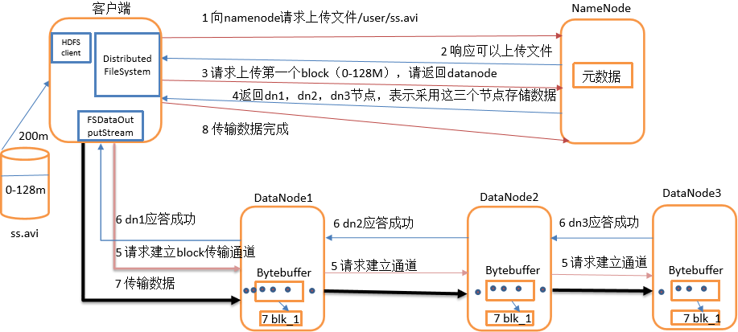

[toc]

# HDFS文件块大小是多少
Hadoop1.x都是64M，hadoop2.x开始都是128M。

# HDFS文件块大小为什么是128M,太大或太小有什么问题？
HDFS中的文件在物理上是分块存储（block），块的大小可以通过配置参数( dfs.blocksize)来规定，默认大小在hadoop2.x版本中是128M，老版本中是64M。

HDFS的块比磁盘的块大，其目的是为了最小化寻址开销。如果块设置得足够大，从磁盘传输数据的时间会明显大于定位这个块开始位置所需的时间。 因而，传输一个由多个块组成的文件的时间取决于磁盘传输速率。

如果寻址时间约为10ms，而传输速率为100MB/s，为了使寻址时间仅占传输时间的1%，我们要将块大小设置约为100MB。默认的块大小128MB。

块的大小：10ms×100×100M/s = 100M，如图

增加文件块大小，需要增加磁盘的传输速率。

# HDFS中的block、packet、chunk 是什么

block
这个大家应该知道，文件上传前需要分块，这个块就是block，一般为128MB，当然你可以去改，不顾不推荐。因为块太小：寻址时间占比过高。块太大：Map任务数太少，作业执行速度变慢。它是最大的一个单位。

packet
packet是第二大的单位，它是client端向DataNode，或DataNode的PipLine之间传数据的基本单位，默认64KB。

chunk
chunk是最小的单位，它是client向DataNode，或DataNode的PipLine之间进行数据校验的基本单位，默认512Byte，因为用作校验，故每个chunk需要带有4Byte的校验位。所以实际每个chunk写入packet的大小为516Byte。由此可见真实数据与校验值数据的比值约为128 : 1。（即64*1024 / 512）

例如，在client端向DataNode传数据的时候，HDFSOutputStream会有一个chunk buff，写满一个chunk后，会计算校验和并写入当前的chunk。之后再把带有校验和的chunk写入packet，当一个packet写满后，packet会进入dataQueue队列，其他的DataNode就是从这个dataQueue获取client端上传的数据并存储的。同时一个DataNode成功存储一个packet后之后会返回一个ack packet，放入ack Queue中。

# HDFS 的读写流程
HDFS存储机制，包括HDFS的写入数据过程和读取数据过程两部分
## HDFS写数据过程

  1）客户端通过Distributed FileSystem模块向NameNode请求上传文件，NameNode检查目标文件是否已存在，父目录是否存在。
  2）NameNode返回是否可以上传。
  3）客户端请求第一个 block上传到哪几个datanode服务器上。
  4）NameNode返回3个datanode节点，分别为dn1、dn2、dn3。
  5）客户端通过FSDataOutputStream模块请求dn1上传数据，dn1收到请求会继续调用dn2，然后dn2调用dn3，将这个通信管道建立完成。
  6）dn1、dn2、dn3逐级应答客户端。
  7）客户端开始往dn1上传第一个block（先从磁盘读取数据放到一个本地内存缓存），以packet为单位，dn1收到一个packet就会传给dn2，dn2传给dn3； dn1每传一个packet会放入一个应答队列等待应答。
  8）当一个block传输完成之后，客户端再次请求NameNode上传第二个block的服务器。（重复执行3-7步）。

## HDFS读数据过程

  1）客户端通过Distributed FileSystem向NameNode请求下载文件，NameNode通过查询元数据，找到文件块所在的DataNode地址。
  2）挑选一台DataNode（就近原则，然后随机）服务器，请求读取数据。
  3）DataNode开始传输数据给客户端（从磁盘里面读取数据输入流，以packet为单位来做校验）。
  4）客户端以packet为单位接收，先在本地缓存，然后写入目标文件。

# secondary namenode工作机制

1）第一阶段：NameNode启动
  （1）第一次启动NameNode格式化后，创建fsimage和edits文件。如果不是第一次启动，直接加载编辑日志和镜像文件到内存。
  （2）客户端对元数据进行增删改的请求。
  （3）NameNode记录操作日志，更新滚动日志。
  （4）NameNode在内存中对数据进行增删改查。

2）第二阶段：Secondary NameNode工作
  （1）Secondary NameNode询问NameNode是否需要checkpoint。直接带回NameNode是否检查结果。
  （2）Secondary NameNode请求执行checkpoint。
  （3）NameNode滚动正在写的edits日志。
  （4）将滚动前的编辑日志和镜像文件拷贝到Secondary NameNode。
  （5）Secondary NameNode加载编辑日志和镜像文件到内存，并合并。
  （6）生成新的镜像文件fsimage.chkpoint。
  （7）拷贝fsimage.chkpoint到NameNode。
  （8）NameNode将fsimage.chkpoint重新命名成fsimage。

# HDFS各个组件的功能作用

架构主要由四个部分组成，分别为HDFS Client、NameNode、DataNode和Secondary NameNode。下面我们分别介绍这四个组成部分。
1）Client：就是客户端。
  （1）文件切分。文件上传HDFS的时候，Client将文件切分成一个一个的Block，然后进行存储；
  （2）与NameNode交互，获取文件的位置信息；
  （3）与DataNode交互，读取或者写入数据；
  （4）Client提供一些命令来管理HDFS，比如启动或者关闭HDFS；
  （5）Client可以通过一些命令来访问HDFS；
2）NameNode：就是Master，它是一个主管、管理者。
  （1）管理HDFS的名称空间；
  （2）管理数据块（Block）映射信息；
  （3）配置副本策略；
  （4）处理客户端读写请求。
3）DataNode：就是Slave。NameNode下达命令，DataNode执行实际的操作。
  （1）存储实际的数据块；
  （2）执行数据块的读/写操作。
4）Secondary NameNode：并非NameNode的热备。当NameNode挂掉的时候，它并不能马上替换NameNode并提供服务。
  （1）辅助NameNode，分担其工作量；
  （2）定期合并Fsimage和Edits，并推送给NameNode；
  （3）在紧急情况下，可辅助恢复NameNode。

# namenode HA 是如何工作的? 

ZKFailoverController主要职责
  1）健康监测：周期性的向它监控的NN发送健康探测命令，从而来确定某个NameNode是否处于健康状态，如果机器宕机，心跳失败，那么zkfc就会标记它处于一个不健康的状态。
  2）会话管理：如果NN是健康的，zkfc就会在zookeeper中保持一个打开的会话，如果NameNode同时还是Active状态的，那么zkfc还会在Zookeeper中占有一个类型为短暂类型的znode，当这个NN挂掉时，这个znode将会被删除，然后备用的NN，将会得到这把锁，升级为主NN，同时标记状态为Active。
  3）当宕机的NN新启动时，它会再次注册zookeper，发现已经有znode锁了，便会自动变为Standby状态，如此往复循环，保证高可靠，需要注意，目前仅仅支持最多配置2个NN。
  4）master选举：如上所述，通过在zookeeper中维持一个短暂类型的znode，来实现抢占式的锁机制，从而判断那个NameNode为Active状态