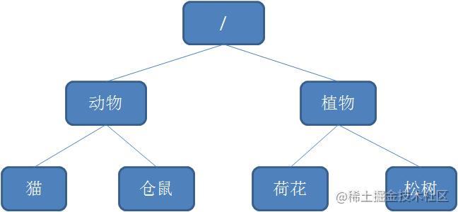
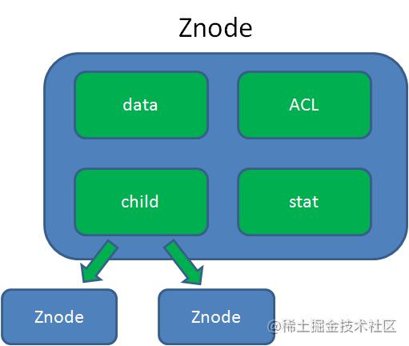
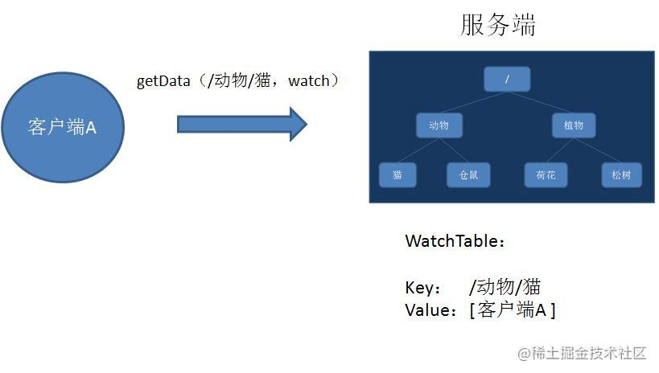
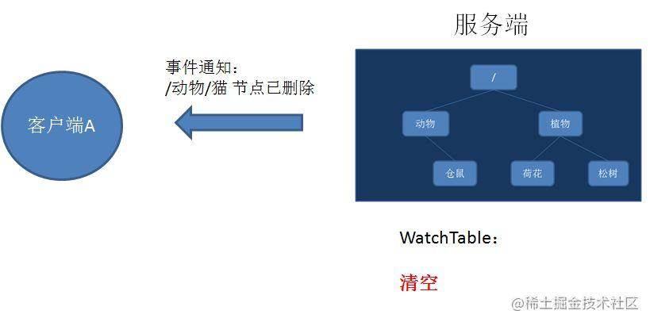
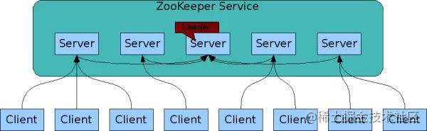
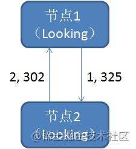
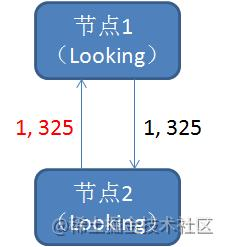
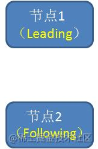
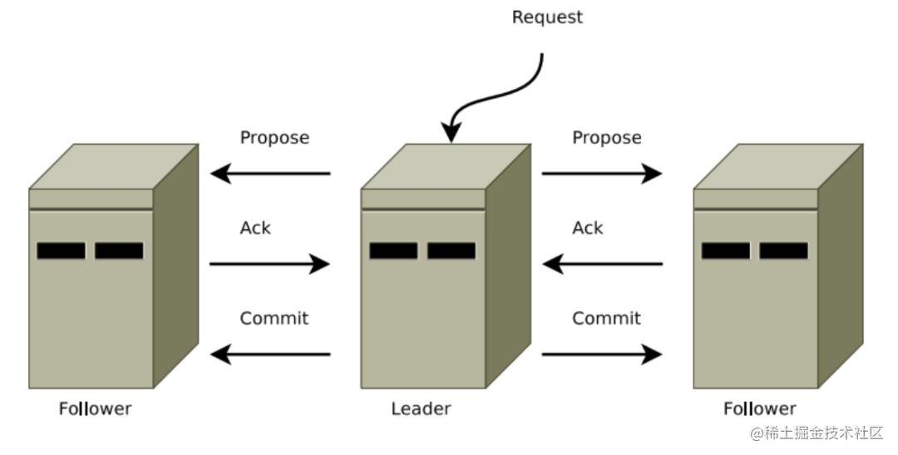

[toc]
# 好文
[漫画: 什么是zookeeper](https://juejin.cn/post/6844903608685707271)

# 什么是zookeeper
zookeeper是一种分布式协调服务，可以再分布式系统中共享配置，协调锁资源，提供命名服务。

## zookeeper的数据模型
zookeeper的数据模型很像数据结构当中的树，也和文件系统目录相似。

树是由节点所组成，zookeeper的数据存储也同样是基于节点，这种节点叫做Znode。
但是，不同于树的节点，Znode的引用方式是路径引用，类似于文件路径。

/动物/仓鼠
/植物/荷花
这样的层级结构，让每一个Znode节点拥有唯一的路径，就像命名空间一样对不同信息做出清晰的隔离。

Znode包含了数据、子节点引用、访问权限

data: Znode存储的数据信息
acl: 记录Znode的访问权限，即那些人或哪些ip可以访问本节点
stat: 包含Znode的各种元数据，比如事务id，版本号，时间戳，大小等等。
child: 当前节点的子节点引用，类似于二叉树的做孩子和有孩子

zookeeper实为读多写少的场景设计的，并不是用来存储大规模业务数据，适用于存储少量的状态和配置信息，每个节点的数据最大不能超过1MB

## zookeeper的基本操作和事件通知
zookeeper 提供了一些简单的api

* create 创建节点
* delete 删除节点
* exists 判断节点是否存在
* getData 获得一个节点的数据
* setData 设置一个节点的数据
* getChildren 获取节点下的所有子节点
  
其中，exists，getData，getChildren属于读操作，zookeeper客户端在请求读操作的时候，可以选择是否设置watch。

watch可以理解成是注册在特定Znode上的触发器，当这个Znode发生改变，也就是调用了create，delete，setData方法时，将会触发Znode上注册的对应事件，请求Watch的客户端会受到异步通知。

## watch的交互过程
1、客户端调用getData方法，watch参数是true。服务端接到请求，返回节点数据，并且在对应的哈希表里插入被watch的Znode路径，以及watcher列表。

2、当被watch的znode已删除，服务端会查找哈希表，找到该node对应的所有watcher，异步通知客户端，并且删除哈希表中对应的key-value

## zookeeper的一致性
zookeeper身为分布式系统的协调服务，如果自身挂掉了，怎么办呢？
答案是zookeeper集群

zookeeper service 集群是一主多从结构
在更新数据时，首先更新到主节点，再同步到从节点
在读取数据时，直接读取任意从节点
为了保证主从节点的数据一致性，zookeeper采用了zab协议，一种非常类似于一致性算法paxos和raft的算法。

## zookeeper的zab协议
zab即 zookeeper automic broadcast,有效解决了zookeeper集群崩溃恢复，以及主从同步数据的问题。

首先来看一下 zab协议定义的三种节点状态：
* Looking: 选举状态
* following： folloer节点所处的状态
* leading： leader节点所处的状态

最大zxid概念：
最大zxid也就是节点本地的最新事无编号，包含epoch和计算量部门。epoch是纪元的意思，相当于raft算法选主时候的term。

加入zookeeper当前主节点挂掉了，集群会进行崩溃恢复，zab崩溃恢复分为三个阶段
1. leader election
   选举阶段，此时集群中的节点处于looking状态，他们会鸽子向其他节点发起投票，投票当中包含自己的服务器id和最新事务id(zxid)
   
2. 接下来，节点会用自生的zxid和从其他节点接收到的zxid做比较，如果发现别人家的zxid比自己大，也就是数据比自己新，那么就重新发起投票，投票给目前已知最大的zxid所属节点
   
3. 每次投票后，服务器都会统计投票数量，判断是否有某个节点得到半数以上的投票。如果存在这个的节点，该节点会成为准leader，状态变为leading，其他节点状态变为follwing
   
   
发现阶段
发现阶段，用于在从节点中发现最新的zxid和事务日志。
这是为了防止某些意外情况，比如因网络原因在上一阶段产生多个leader的情况。
所以这一阶段，leaderLeader集思广益，接收所有Follower发来各自的最新epoch值。Leader从中选出最大的epoch，基于此值加1，生成新的epoch分发给各个Follower。

各个Follower收到全新的epoch后，返回ACK给Leader，带上各自最大的ZXID和历史事务日志。Leader选出最大的ZXID，并更新自身历史日志。

Synchronization同步阶段
Synchronization同步阶段,把Leader刚才收集得到的最新历史事务日志，同步给集群中所有的Follower。只有当半数Follower同步成功，这个准Leader才能成为正式的Leader。自此，故障恢复正式完成。

## zab 怎么写入数据呢
什么是Broadcast呢？简单来说，就是Zookeeper常规情况下更新数据的时候，由Leader广播到所有的Follower。其过程如下：

1. 客户端发出写入数据请求给任意Follower。
2. Follower把写入数据请求转发给Leader。
3. Leader采用二阶段提交方式，先发送Propose广播给Follower。
4. Follower接到Propose消息，写入日志成功后，返回ACK消息给Leader。
5. Leader接到半数以上ACK消息，返回成功给客户端，并且广播Commit请求给Follower。
   

Zab协议既不是强一致性，也不是弱一致性，而是处于两者之间的单调一致性。它依靠事务ID和版本号，保证了数据的更新和读取是有序的。

## Zookeeper的应用
1. 分布式锁
这是雅虎研究员设计Zookeeper的初衷。利用Zookeeper的临时顺序节点，可以轻松实现分布式锁。
2. 服务注册和发现
利用Znode和Watcher，可以实现分布式服务的注册和发现。最著名的应用就是阿里的分布式RPC框架Dubbo。
3. 共享配置和状态信息
Redis的分布式解决方案Codis，就利用了Zookeeper来存放数据路由表和 codis-proxy 节点的元信息。同时 codis-config 发起的命令都会通过 ZooKeeper 同步到各个存活的 codis-proxy。

此外，Kafka、HBase、Hadoop，也都依靠Zookeeper同步节点信息，实现高可用。

